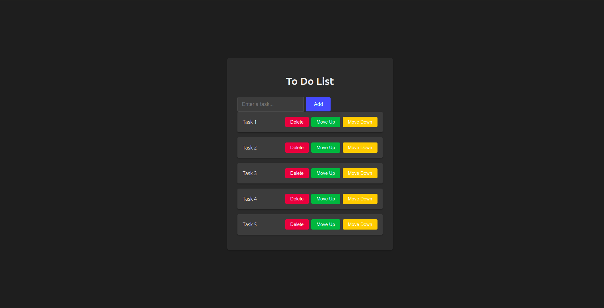

# To-Do List App

Welcome to the **To-Do List App**, a simple and interactive React-based task management application. This project demonstrates essential React concepts like component state management, event handling, and array operations.



## Features

- **Add Tasks**: Create new tasks to organize your daily activities.
- **Delete Tasks**: Remove tasks you no longer need.
- **Prioritize Tasks**: Move tasks up to set a higher priority.
- **Deprioritize Tasks**: Shift tasks down to lower their priority.

## Getting Started

### Prerequisites
Ensure you have the following installed:
- [Node.js](https://nodejs.org/) (v12 or later)
- [npm](https://www.npmjs.com/) or [yarn](https://yarnpkg.com/)

### Installation
1. Clone the repository:
   ```bash
   git clone https://github.com/yourusername/todo-list-app.git
   ```
2. Navigate into the project directory:
   ```bash
   cd todo-list-app
   ```
3. Install dependencies:
   ```bash
   npm install
   ```
   or
   ```bash
   yarn install
   ```

### Run the App
Start the development server with:
```bash
npm start
```
or
```bash
yarn start
```

The app will be available at [http://localhost:3000](http://localhost:3000).

## Code Overview
### Main Components:
- **ToDoList Component**: Contains state management, task addition, deletion, prioritization, and deprioritization functions.

### Key Functions:
- **handleInputChange**: Updates `newTask` state with user input.
- **addTask**: Adds a new task to the task list if the input is non-empty.
- **deleteTask**: Removes a task at a specified index.
- **prioritizeTask**: Moves a task up in the list.
- **deprioritizeTask**: Moves a task down in the list.

## Project Structure
```
src/
|-- components/
|   |-- ToDoList.js
|-- App.js
|-- index.js
|-- styles/
|   |-- App.css
|-- assets/
|   |-- preview-image.png
```

## Customization
- **Styling**: You can update `App.css` to modify the UI according to your design preferences.
- **Functionality**: Extend the app to include features like task editing, due dates, or completed task toggles.

## Contributing
Feel free to fork this project and make your own changes. Contributions are welcome!

## License
This project is licensed under the MIT License. See the [LICENSE](LICENSE) file for more details.

---
Enjoy using and building upon this To-Do List App! If you have any questions or suggestions, please reach out or submit an issue on the GitHub repository.


